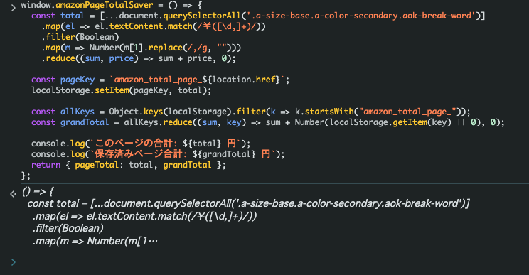
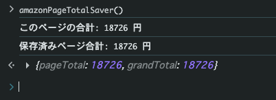
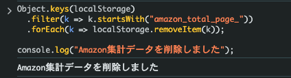

# Amazon Total Spent Calculator

Amazonの注文履歴ページから、これまでの購入金額を集計するためのスクリプトです。
ブラウザのコンソールから実行できます。

---

# Usage

Amazonの注文履歴ページに表示されている注文金額を集計し、
**ページごとの合計を localStorage に保存しながら総額を計算**します。

---

## 1. コンソールを開く

Amazonの注文履歴ページを開き、ブラウザのコンソールを開きます。

```
F12 → Console
```

---

## 2. 関数を定義する

以下のコードをコンソールに貼り付けて関数を定義します。

```javascript
window.amazonPageTotalSaver = () => {
  const total = [...document.querySelectorAll('.a-size-base.a-color-secondary.aok-break-word')]
    .map(el => el.textContent.match(/￥([\d,]+)/))
    .filter(Boolean)
    .map(m => Number(m[1].replace(/,/g, "")))
    .reduce((sum, price) => sum + price, 0);

  const pageKey = `amazon_total_page_${location.href}`;
  localStorage.setItem(pageKey, total);

  const allKeys = Object.keys(localStorage).filter(k => k.startsWith("amazon_total_page_"));
  const grandTotal = allKeys.reduce((sum, key) => sum + Number(localStorage.getItem(key) || 0), 0);

  console.log(`このページの合計: ${total} 円`);
  console.log(`保存済みページ合計: ${grandTotal} 円`);
  return { pageTotal: total, grandTotal };
};
```



---

## 3. 集計を実行する

関数を実行します。

```javascript
amazonPageTotalSaver()
```

実行すると

- 現在のページの合計金額
- これまで保存されたページの合計金額

がコンソールに表示されます。



---

## 4. 次のページへ進む

注文履歴の **次のページへ移動**します。

ページが切り替わるとコンソールがリセットされるため、
再度 **関数定義 → 実行** を行います。

```
① 関数を貼り付け
② amazonPageTotalSaver()
```

これを **最後のページまで繰り返します。**

---

## 5. 最終合計を確認

最後のページで表示される

```
grandTotal
```

が、集計された注文金額の合計になります。

例

```
{ pageTotal: 2350, grandTotal: 18726 }
```

この場合

```
18726 円
```

が合計金額です。

---

# Reset (別の年を集計する場合)

別の年の注文履歴を集計する場合は、
保存された localStorage のデータを削除します。

```javascript
Object.keys(localStorage)
  .filter(k => k.startsWith("amazon_total_page_"))
  .forEach(k => localStorage.removeItem(k));

console.log("Amazon集計データを削除しました");
```



削除後、再び **手順1から実行**してください。
